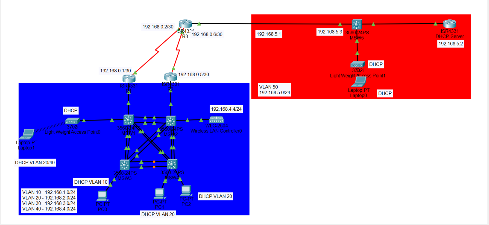

# Enterprise LAN/WLAN Network Simulation

This project simulates a redundant enterprise LAN/WLAN infrastructure built in Cisco Packet Tracer.  
It demonstrates the design and configuration of VLANs, redundancy mechanisms, Layer 2 security, and wireless integration within an enterprise environment.

---

## 1. Project Overview

The network topology provides redundancy at both the switching and gateway levels.  
It includes four interconnected switches using EtherChannel and redundant routers implementing HSRP as the default gateway.  
A dedicated stub network is used for the DHCP server, and two access points provide wireless coverage in separate zones.

---

## 2. Logical Topology

The logical topology interconnects the switches and routers through redundant links to ensure high availability.  
Each VLAN is assigned to a specific subnet and configured for inter-VLAN routing through HSRP.

---

## 3. VLAN Configuration

| VLAN | Subnet          | Description          |
|------|-----------------|----------------------|
| 10   | 192.168.1.0/24  | PC-A Network         |
| 20   | 192.168.2.0/24  | PC-B Network         |
| 30   | 192.168.3.0/24  | WiFi-A Network       |
| 40   | 192.168.4.0/24  | Administration       |
| 50   | 192.168.5.0/24  | WiFi-B Network       |
| 1000 | —               | Unused / Blackhole   |

Trunk links and EtherChannel are configured among the switches to improve bandwidth and redundancy.

---

## 4. Redundancy and Traffic Flow

**HSRP** provides gateway redundancy across routers.  
Traffic distribution is optimized by designating active routers based on VLAN groups:

- VLANs 10 and 30 flow through the left router.
- VLANs 20 and 40 flow through the right router.

**Spanning Tree Protocol (STP)** is configured with adjusted bridge priorities to align traffic flow with HSRP behavior:
- MSW1 is the root bridge for VLANs 10 and 30.
- MSW2 is the root bridge for VLANs 20 and 40.

---

## 5. Layer 2 Security Configuration

Layer 2 protection mechanisms include:

- **DHCP Snooping** to prevent DHCP starvation and spoofing attacks.  
- **Dynamic ARP Inspection (DAI)** to mitigate ARP poisoning.  
- **Port-Security** to limit MAC address violations.  
- **BPDU Guard** to block unauthorized switches.  
- **CDP disabled** to hide network infrastructure information.  
- **Unused ports** are shutdown and assigned to VLAN 1000.  
- **DTP disabled** on all access interfaces.  

Each device contains a local user database:
Username: gozzki
Password: cisco
Enable password: cisco

---

## 6. WLAN Configuration

Two wireless networks are managed by a centralized Wireless LAN Controller (WLC).  
Each Lightweight Access Point (LWAP) connects through DHCP to obtain an address.

WLAN credentials: 
SSID: Corporate_WLAN
Password: cisco123

---

## 7. Routing Configuration

Static and floating static routes are used to maintain connectivity between VLANs and the DHCP server network.  
Backup routes follow the same redundancy logic as HSRP and STP (left and right paths depending on VLAN).

---

## 8. Recommendations

To further improve the design:
- Implement Access Control Lists (ACLs) to restrict administrative access.  
- Use a dynamic routing protocol such as OSPF or EIGRP for scalability and automatic path recovery.

---

## 9. Files Included

| File | Description |
|------|-------------|
| `project/PIA_2024404.pkt` | Cisco Packet Tracer simulation file |
| `docs/presentacion_pia.pdf` | Original project documentation |
| `diagrams/logical_topology.png` | Logical topology diagram |

---

## 10. Author

**Gustavo Martínez Lozano**  

